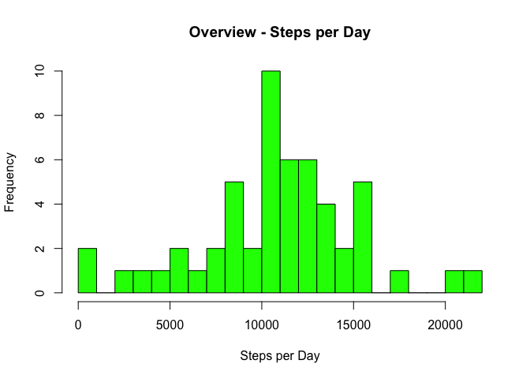

# Coursera Course Reproducible Research - Week 2
Wener Steinbeck  
11 November 2016  


```r
knitr::opts_chunk$set(echo = FALSE)
```

## Checklist of the full submission

* Code for reading in the dataset and/or processing the data
* Histogram of the total number of steps taken each day
* Mean and median number of steps taken each day
* Time series plot of the average number of steps taken
* The 5-minute interval that, on average, contains the maximum number of steps
* Code to describe and show a strategy for imputing missing data
* Histogram of the total number of steps taken each day after missing values are imputed
* Panel plot comparing the average number of steps taken per 5-minute interval across weekdays and weekends  

## Description of the original data
The data comes from a personal activity monitoring device. This device collects data at 5 minute intervals through out the day. The data consists of two months worth of data from an anonymous individual collected during the months of October and November, 2012 and include the number of steps taken in 5 minute intervals each day.

### Variables in the data set
The variables in the data set are  
**steps**  - Number of steps taking in a 5-minute interval
**date**  - The date on which the measurement was taken in YYYY-MM-DD format  
**interval**  - Identifier for the 5-minute interval in which measurement was taken


The dataset is stored in a comma-separated-value (**CSV**) file and there are a total of **17,568** observations in this dataset.

## Working through the tasks of the assignment
### Prerequistes and Packages
* Assume the CSV file is in the working directory
* Required R packages: dplyr


### Loading and preprocessing the data

Showing code needed to load the data and further analysis steps


```r
# Read the CSV file 
MyActiveDays <- read.csv("activity.csv")
# Tidy this up by getting the NA observations out
goodActivity <- complete.cases(MyActiveDays)
ActiveCases <-MyActiveDays[goodActivity, ]    # So the observations with data
```

### What is mean total number of steps taken per day?

For this part of the assignment, the missing values in the dataset could have been ignored.  

1. To calculate the mean total number of steps taken per day, we 
	*  Calculate the mean values for each day
	*  Calculate the mean of these resulting daily values
2. Make a histogram of the total number of steps taken each day
3. Calculate and report the mean and median of the total number of steps taken per day

**Code**

```r
StepsPerDay <- summarise(group_by(ActiveCases, date), SumOfSteps = sum(steps))
MeanStepsPerDay <- mean(StepsPerDay$SumOfSteps)
MedianStepsPerDay <- median(StepsPerDay$SumOfSteps)

# Produce a histogram
hist(StepsPerDay$SumOfSteps, breaks = 20, col  = "green", main = "Overview - Steps per Day", xlab = "Steps per Day")
```

<!-- -->


#### Report on the Data

The mean total number of steps taken per day is 1.0766189\times 10^{4}. The median total number of steps taken per day is 10765.


### What is the average daily activity pattern?

Task: A time series plot of the 5-minute interval (x-axis) and the average number of steps taken, averaged across all days (y-axis)


```r
# Calculate the average number of steps for a given interval
MeanStepsPerInterval <- summarise(group_by(ActiveCases, interval), MeanSteps = mean(steps))
# Plot the number of steps over the intervals
plot (MeanStepsPerInterval$interval, MeanStepsPerInterval$MeanSteps, type = "l", col  = "blue", main = "Number of Steps during the Day", xlab = "Time of the Day (Intervals)", ylab = "Average number of steps")
```

<!-- -->

**Question:** Which 5-minute interval, on average across all the days in the dataset, contains the maximum number of steps?


```r
MaximumInterval <- filter(MeanStepsPerInterval, MeanSteps == max(MeanSteps))$interval
```
 
**Answer:** 835

### Imputing missing values

Note that there are a number of days/intervals in thwe original data set where there are missing values (coded as NA). The presence of missing days may introduce bias into some calculations or summaries of the data.

**Task:** Calculate and report the total number of missing values in the dataset.  


```r
NumberofNAs <- sum(is.na(MyActiveDays$steps))
```

The number of missing values in the original data set is **2304**.

* Devise a strategy for filling in all of the missing values in the dataset. The strategy does not need to be sophisticated. For example, you could use the mean/median for that day, or the mean for that 5-minute interval, etc.
* Strategy here is to
     * Pick the idea mentioned above
     * For each day use the mean value found earlier for that time interval to replace the NA value. 
     * Just for this exercise.
* Create a new dataset that is equal to the original dataset but with the missing data filled in.


```r
ImputeMyActiveDays <- cbind(MyActiveDays, MeanStepsPerInterval$MeanSteps)
names(ImputeMyActiveDays)[4] <- c("AddMeans")
# Modify where needed in the vector of steps
ImputeMyActiveDays$steps <- ifelse( is.na(ImputeMyActiveDays$steps), ImputeMyActiveDays$AddMeans, ImputeMyActiveDays$steps)
ImputeMyActiveDays <- ImputeMyActiveDays[1:3]   # Pick the first three columns - like original data set was
```

* Make a histogram of the total number of steps taken each day and 
* Calculate and report the mean and median total number of steps taken per day. 

For this part of the assignment, the missing values in the dataset have been imputed (!)  

1. To calculate the mean total number of steps taken per day, we 
	*  Calculate the mean values for each day again - based on modified data set
	*  Calculate the mean of these resulting daily values
2. Make a histogram of the total number of steps taken each day
3. Calculate and report the mean and median of the total number of steps taken per day


```r
StepsPerDay2 <- summarise(group_by(ImputeMyActiveDays, date), SumOfSteps = sum(steps))
MeanStepsPerDay2 <- mean(StepsPerDay$SumOfSteps)
MedianStepsPerDay2 <- median(StepsPerDay$SumOfSteps)

# Produce a histogram
hist(StepsPerDay2$SumOfSteps, breaks = 20, col  = "red", main = "IMPUTED Data - Steps per Day", xlab = "Steps per Day")
```

<!-- -->


#### Report on the Data
The mean total number of steps taken per day is 1.0766189\times 10^{4}. The median total number of steps taken per day is 10765.


**Question:** Do these values differ from the estimates from the first part of the assignment? What is the impact of imputing missing data on the estimates of the total daily number of steps?

**Answer:** Difference in the mean is 0, difference in the median is 0.
Imputing the data does not seem to change the overall picture.

### Are there differences in activity patterns between weekdays and weekends?

For this part of the assignment we use the weekdays() function as recommended.
We keep using the **imputed** data set due to its (artifical) completeness.

#### Tasks
* Create a new factor variable in the dataset with two levels indicating whether a given date is a weekday or weekend day.


```r
# Add column with actual day names
ImputeMyActiveDays <- cbind(ImputeMyActiveDays, DayName = weekdays(as.Date(ImputeMyActiveDays$date)))
# Mark the weekend
ImputeMyActiveDays <- cbind(ImputeMyActiveDays, Weekend = (ImputeMyActiveDays$DayName %in% c("Sunday", "Saturday")))
# The ask was make a factor variable with levels "weekday" and "weekend"
ImputeMyActiveDays$Weekend <- ifelse(ImputeMyActiveDays$Weekend, "weekend", "weekday")
ImputeMyActiveDays$Weekend <- as.factor(ImputeMyActiveDays$Weekend)
```

* Make a panel plot containing a time series plot of the 5-minute interval (x-axis) and the average number of steps taken, averaged across all weekday days or weekend days (y-axis).


```r
# Break data in weekend vs. weekdays
WeekendData <- ImputeMyActiveDays[ImputeMyActiveDays$Weekend == "weekend",]
WeekdayData <- ImputeMyActiveDays[ImputeMyActiveDays$Weekend == "weekday",]

# Calculate the means
MeanStepsPerIntervalWE <- summarise(group_by(WeekendData, interval), MeanStepsWE = mean(steps))
MeanStepsPerIntervalWD <- summarise(group_by(WeekdayData, interval), MeanStepsWD = mean(steps))
# Plot the data
par(mfrow=c(2,1))

plot( x=MeanStepsPerIntervalWE$interval, 
      y=MeanStepsPerIntervalWE$MeanStepsWE, 
      type="l",
      col="blue",
      main="Average # of steps on weekends per interval",
      ylab="Average # of steps", 
      xlab="5 min Time interval")

plot( x=MeanStepsPerIntervalWD$interval, 
      y=MeanStepsPerIntervalWD$MeanStepsWD, 
      type="l",
      col="red",
      main="Average # of steps on weekdays per interval",
      ylab="Average # of steps", 
      xlab="5 min Time interval")
```

<!-- -->
